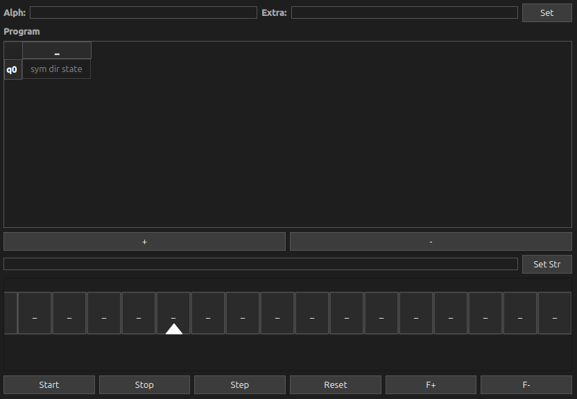

# Turing Machine Emulator

Графический эмулятор машины Тьюринга на C++.

## Особенности
Команда в ячейку таблицы записывается в формате `символ` `направление (L, R, N)` `состояние`. Для обозначения завершения программы нужно оставить ячейку полностью пустой.
- **Плавная анимация** — каретка и лента движутся плавно, без рывков
- **Визуальная отладка** — подсветка текущего состояния в таблице переходов
- **Валидация ввода** — проверка алфавитов, команд и состояний
- **Защита от зацикливания** — автоматическая остановка при превышении лимита шагов
- **Управление с клавиатуры** — перемещение с помощью курсора или стрелками на клавиатуре

### Требования
- Qt 5.15+ или Qt 6
- C++17
- CMake или qmake
